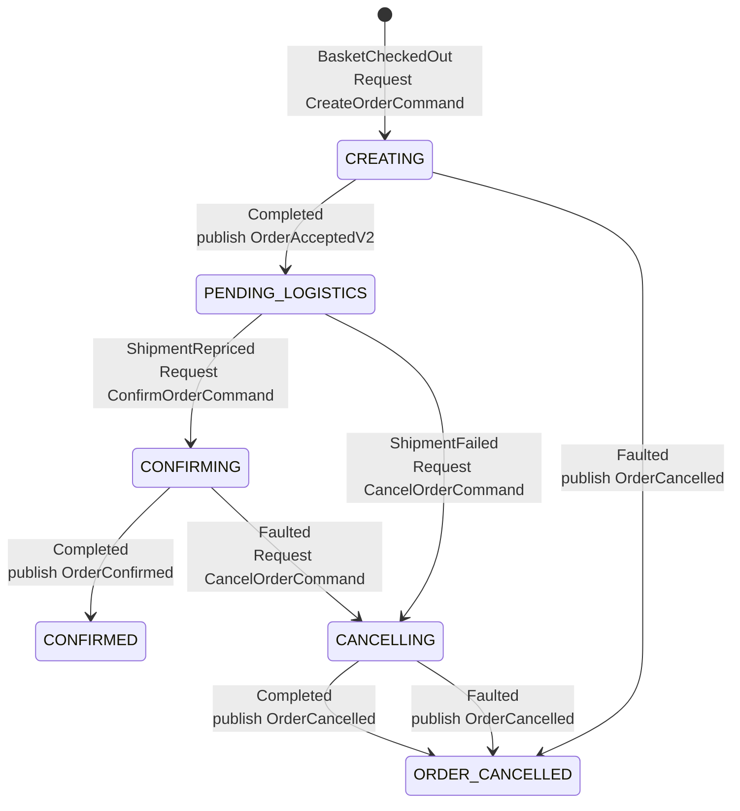

# EventDrivenCheckout

---

## 1. Events & Schemas

All events are published to RabbitMQ via MassTransit. Interface-based contracts allow additive versioning without breaking existing consumers.

### BasketCheckedOut
Entry point. Published by the Basket service. Initiates the order saga.

```json
{
  "correlationId": "3fa85f64-5717-4562-b3fc-2c963f66afa6",
  "userId": "user-abc123",
  "triggerFailure": false,
  "items": [
    { "productId": "prod-1", "name": "T-Shirt", "price": 29.99, "quantity": 2 },
    { "productId": "prod-2", "name": "Jeans",   "price": 59.99, "quantity": 1 }
  ]
}
```

### OrderAccepted / OrderAcceptedV2
Published by the Order saga after `CreateOrder` request completes successfully. Consumed by the Logistics service to trigger shipment reservation.

```json
{
  "orderId": "3fa85f64-5717-4562-b3fc-2c963f66afa6",
  "triggerFailure": false
}
```
V2 extension:
```json
{
  "orderId": "3fa85f64-5717-4562-b3fc-2c963f66afa6",
  "triggerFailure": false,
  "hey": "Hi from V2"
}
```

### ShipmentRepriced
Published by the Logistics service when it has calculated a shipping price. Drives the saga from `PENDING_LOGISTICS` → `CONFIRMING`.

```json
{
  "orderId": "3fa85f64-5717-4562-b3fc-2c963f66afa6",
  "shippingPrice": 9.99
}
```

### ShipmentFailed
Published by the Logistics service when it cannot fulfil the shipment. Drives the saga toward cancellation.

```json
{
  "orderId": "3fa85f64-5717-4562-b3fc-2c963f66afa6"
}
```

### ShipmentReserved
Published by the Logistics service after shipment is confirmed. Currently informational — not yet consumed by the saga.

```json
{
  "orderId": "3fa85f64-5717-4562-b3fc-2c963f66afa6"
}
```

### OrderConfirmed
Published by the Order saga after `ConfirmOrder` request completes. Consumed downstream (e.g. notifications, billing).

```json
{
  "orderId": "3fa85f64-5717-4562-b3fc-2c963f66afa6"
}
```

### OrderCancelled
Published by the Order saga after `CancelOrder` request completes.

```json
{
  "orderId": "3fa85f64-5717-4562-b3fc-2c963f66afa6"
}
```

---

## 2. States & Transitions

The `OrderStateMachine` orchestrates the full checkout lifecycle. The saga instance is keyed by `OrderId` (= `BasketCheckedOut.CorrelationId`).

### State Diagram



### Transition Table

| Current State      | Event / Response              | Action                          | Next State          |
|--------------------|-------------------------------|---------------------------------|---------------------|
| Initial            | `BasketCheckedOut`            | Request `CreateOrderCommand`    | `CREATING`          |
| `CREATING`         | `CreateOrder.Completed`       | Publish `OrderAcceptedV2`       | `PENDING_LOGISTICS` |
| `CREATING`         | `CreateOrder.Faulted`         | Publish `OrderCancelled`        | `ORDER_CANCELLED`   |
| `PENDING_LOGISTICS`| `ShipmentRepriced`            | Request `ConfirmOrderCommand`   | `CONFIRMING`        |
| `PENDING_LOGISTICS`| `ShipmentFailed`              | Request `CancelOrderCommand`    | `CANCELLING`        |
| `CONFIRMING`       | `ConfirmOrder.Completed`      | Publish `OrderConfirmed`        | `CONFIRMED`         |
| `CONFIRMING`       | `ConfirmOrder.Faulted`        | Request `CancelOrderCommand`    | `CANCELLING`        |
| `CANCELLING`       | `CancelOrder.Completed`       | Publish `OrderCancelled`        | `ORDER_CANCELLED`   |
| `CANCELLING`       | `CancelOrder.Faulted`         | Publish `OrderCancelled`        | `ORDER_CANCELLED`   |

### Who Reacts to What

| Event               | Producer         | Consumer(s)                    |
|---------------------|------------------|--------------------------------|
| `BasketCheckedOut`  | Basket service   | Order saga                     |
| `OrderAcceptedV2`   | Order saga       | Logistics service              |
| `ShipmentRepriced`  | Logistics service| Order saga                     |
| `ShipmentFailed`    | Logistics service| Order saga                     |
| `ShipmentReserved`  | Logistics service| (not consumed in demo)         |
| `OrderConfirmed`    | Order saga       | (not consumed in demo)         |
| `OrderCancelled`    | Order saga       | (not consumed in demo)         |

---

## 3. Idempotency, Duplicate Detection & Out-of-Order Handling

### Idempotency

`OrderId` is set by the saga (equals `BasketCheckedOut.CorrelationId`) — a client-generated ID. This means every command the saga sends is inherently idempotent: if the saga retries a request after a transient failure, the consumer receives the same `OrderId` again.

Each command consumer should also guard against duplicates:

```csharp
// Example in CreateOrderConsumer
if (await db.Orders.AnyAsync(o => o.Id == message.OrderId))
    return; // already exists — respond as success, do not insert again
```

### Transactional Outbox

The Order service uses the MassTransit Entity Framework outbox. This eliminates the dual-write problem — the scenario where a message is published to RabbitMQ but the corresponding database transaction rolls back, or the DB write succeeds but the message is never delivered.

With the outbox enabled, any message published during saga processing is first written to the same SQL transaction as the saga state update. MassTransit then delivers the message to RabbitMQ only after the transaction commits successfully. This gives a strong guarantee: if the message is on the bus, the state change is in the database, and vice versa.

This also means that in failure scenarios — such as the process crashing between a DB write and a RabbitMQ publish — the outbox will redeliver the message on next startup, making the overall system self-healing without any manual intervention.

### Duplicate Event Detection

MassTransit persists saga state in the database. Because the saga only transitions state once per event (e.g. `CREATING` → `PENDING_LOGISTICS`), a duplicate `CreateOrder.Completed` arriving after the transition has no effect — the saga is no longer in `CREATING` and MassTransit ignores events that don't match the current state.

For externally published events (`ShipmentRepriced`, `ShipmentFailed`), the same applies: they are only handled in `PENDING_LOGISTICS`. A late duplicate arriving in `CONFIRMING` is silently discarded.

### Out-of-Order Handling

The saga's state machine provides a natural first layer of protection: events that arrive in the wrong state are simply not handled and are discarded, preventing corrupt transitions.

For cases where out-of-order delivery is likely and the event must not be lost, the common strategy is to buffer the early-arriving event (either in the saga state itself or in a separate inbox) and re-evaluate it once the saga reaches the expected state. Another approach is to design the state transitions to be commutative where possible — meaning the end result is the same regardless of the order events arrive.

---

## 4. Error Flows, Timeouts & Compensation

### Fault Handling

Each request in the saga has an explicit `Faulted` handler. When a consumer throws an unhandled exception, MassTransit sends a fault message back to the saga which triggers these handlers — preventing the saga from getting permanently stuck in a transient state.

| Faulted Request  | Action                                      | Next State        |
|------------------|---------------------------------------------|-------------------|
| `CreateOrder`    | Publish `OrderCancelled`                    | `ORDER_CANCELLED` |
| `ConfirmOrder`   | Request `CancelOrderCommand` (compensate)   | `CANCELLING`      |
| `CancelOrder`    | Publish `OrderCancelled` (best effort)      | `ORDER_CANCELLED` |

The `ConfirmOrder` fault path attempts a graceful compensation by still going through the cancel flow. The `CancelOrder` fault is treated as a terminal failure — the order is marked cancelled regardless, as there is no further compensation possible at that point.

### Timeouts

Timeouts are a safety net for requests that never receive a response — for example when a downstream service is down, a message is lost, or a consumer crashes mid-processing. Without a timeout the saga would remain stuck in a transient state indefinitely with no way to recover automatically.

The general strategy is to define a maximum wait time per request and handle the `TimeoutExpired` event explicitly — typically by compensating (cancelling the order) or alerting for manual intervention. The appropriate timeout value depends on the SLA of the downstream service and the expected processing time.

In this project timeouts are intentionally disabled (`Timeout = TimeSpan.Zero`) for simplicity. In a production system each request would have a timeout defined, and the saga would have explicit handling for the expired case alongside the fault handlers.

### Compensation Flow

When `ShipmentFailed` is received, the saga compensates by cancelling the order:

```
ShipmentFailed → CancelOrderCommand → OrderCancelled published
```

If `ConfirmOrder` faults, the same compensation path applies — request `CancelOrder` before transitioning.

---

## 5. Observability

### IDs to Log on Every Event

| ID | Source | Why |
|----|--------|-----|
| `OrderId` | All events post-creation | Primary correlation across all services |
| `BasketCheckedOut.CorrelationId` | Entry event | Equals `OrderId` — links basket → order |

Since `OrderId == BasketCheckedOut.CorrelationId`, a single ID is sufficient to trace the full journey from basket submission to order confirmed or cancelled.
